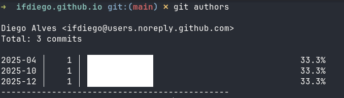

# git-authors

A Git alias for viewing commit statistics by author in a repository.



#### Getting Started

Download the installer with curl:
```bash
curl -O https://raw.githubusercontent.com/ifdiego/git-authors/refs/heads/main/install.sh
```

Run it:
```bash
bash install.sh
```

Usage:
```bash
git authors
```
